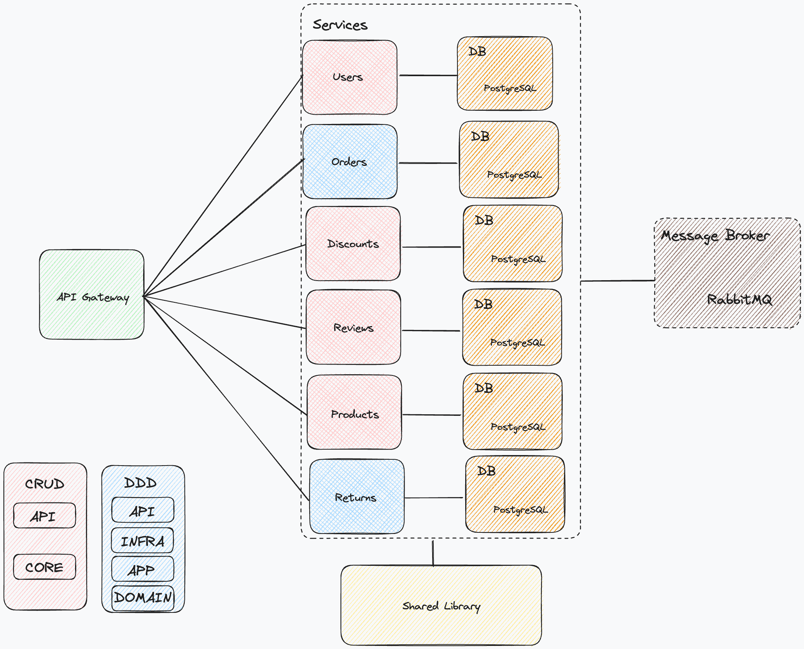

# Ecommerce Web Api

This project is an Ecommerce Web API built using the microservices architecture. Each service is responsible for a specific business capability. Services communicate with each other using messages via RabbitMq message broker. The Gateway is responsible for routing the requests to the appropriate microservices.. It's designed to study and practice Domain-Driven Design (DDD) concepts. The project is written in C# and uses .NET 7, Docker, PostgreSQL, xUnit, Convey, RabbitMQ.

## Event Storming
[Here](https://miro.com/app/board/uXjVMy3rVUc=/?share_link_id=104061673349) you can find the Miro board with the Event Storming session.

## Architecture


## Docker

This project uses Docker to containerize the microservices and the infrastructure services. Docker allows us to package our application along with its environment, which simplifies deployment and ensures consistency across different environments.

### Docker Compose

We use Docker Compose to manage the multi-container application. Docker Compose allows us to define and run multi-container Docker applications using a YAML file. It provides a way to document and configure all of the application’s service dependencies.

Here are the Docker Compose files used in this project:

- `infrastructure.yml`: This file contains the configuration for the infrastructure services such as PostgreSQL databases and RabbitMQ message broker.

- `services.yml`: This file contains the configuration for the microservices of the application.

### Running the Application with Docker

To run the application, navigate to the `compose` directory and execute the following commands:

```bash
docker-compose -f infrastructure.yml up -d
docker-compose -f services.yml up -d
```

## Technologies
- .NET 7
- Docker
- PostgreSQL
- xUnit
- RabbitMQ
